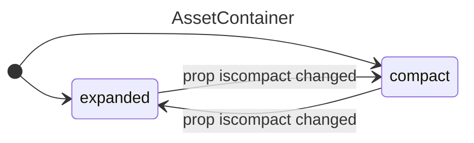

## AssetContainer
### Props
```diff
isCompact (bool). From [InstitutionContainer]
onDeleteAsset (function) From [RecordForm]
+ assetName (string `institutions.ID.assets.ID`) used for registering input

- Asset (array) From [InstitutionContainer] // used before use-hook-form
- InstitutionId 
- AssetId // used for registering fields to useForm, but later joined replaced with single assetName prop 
```

### Listeners
- deleteButton onClick 
- inputs onChange

### States


## See also
- [next.js/examples/next-forms at canary · vercel/next.js · GitHub](https://github.com/vercel/next.js/tree/canary/examples/next-forms)
- [Data Fetching: Server Actions and Mutations | Next.js](https://nextjs.org/docs/app/building-your-application/data-fetching/server-actions-and-mutations#forms)
- https://react-hook-form.com/docs/usefieldarray