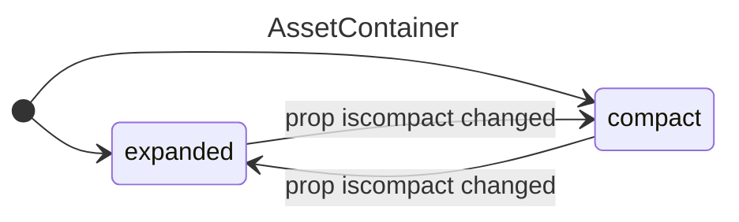

## AssetContainer
### Props
```diff
isCompact (bool). From [InstitutionContainer]
onDeleteAsset (function) From [RecordForm]
+ assetName (string `institutions.ID.assets.ID`) used for registering input

- Asset (array) From [InstitutionContainer] // used before use-hook-form
- InstitutionId 
- AssetId // used for registering fields to useForm, but later joined replaced with single assetName prop 
```

### Listeners
- deleteButton onClick 
- inputs onChange

### States
