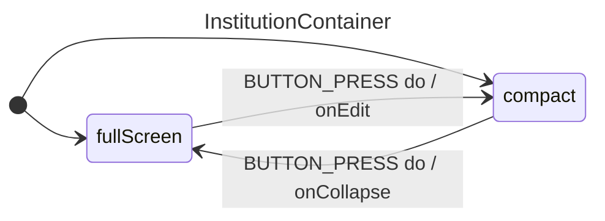

## InstitutionContainer
### Props
```diff
Props
- isFullScreen (bool) replaced with isInstitutionOpen
- Institution (object) replaced with fields from useFieldArray()
+ isInstitutionOpen (bool) renamed to represent logic, rather than appearance
+ InstitutionName (string) 
- onEdit (function) replaced by handleInstitutionOpen
- onCollapse (function) replaced by handleInstitutionOpen
- onDelete (function) replaced by built-in useFieldArray remove
- onReset (function) replaced by built-in useFormContext resetField
- onAddAsset (function) replaced by built-in useFieldArray append
Context
+ handleInstitutionOpen (function) formerly onEdit and onCollapse
+ useFormContext()
+ useFieldArray()
```

### Listeners
- editButton onClick
- collapseButton onClick
- addAssetButton onClick
- deleteButton onClick
- resetButton onClick
---
- nameInput onChange
- countryInput onChange

### States
