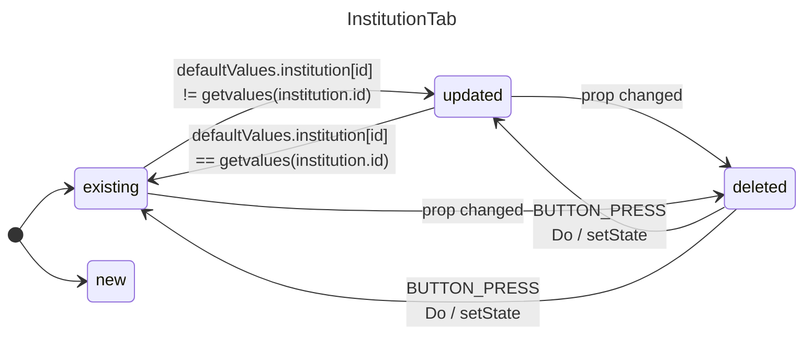

## InstitutionTab
### Props
```diff
//Props
- isNew
- isDeleted
- isUpdated
- text
+ insitutionName (string)
onRestore

//Context
+ useFormContext()
```

### Listeners
- restoreButton click

### States


## Worklog
### Deriving the states
I want to minimize states number. By somehow derive from existing use-hook-form states

#### New state
Probably can be known via comparison between institution value and defaultValues(which are retrieved)
For this scenario probably the simplest reliable way is to generate unique ID for institution and store it in db.

Field values can be retrieved from `fields` https://react-hook-form.com/docs/usefieldarray#:~:text=Description-,fields,-object%20%26%20%7B%20id

if `institutions.ID.name` from `fields` === '' than institution is new

#### Deleted state
can be set by disabling institution fields??

#### Updated state
~~can be retrived from `isDirty`~~
Retrieved by comparison between `defaulValues.institutions[id]` and current values of `institutions[id]`

### Text prop
`text`(`InstitutionName`) retrieved by `useWatch()`, **but there is problem of retreiving value from disabled inputs**(which i planned to use for deleted state) https://github.com/orgs/react-hook-form/discussions/11533
