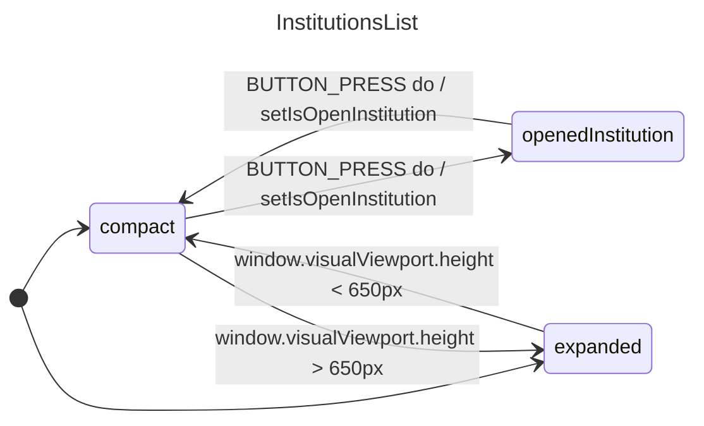

## InstitutionsList
### Props
```diff
// Props
- isCompact (bool)
- isOpenedInstitution (bool)
- institutions (array)
+ isInstitutionOpen (bool)

// Context
+ selectedInstitution (int)
+ { institutionsFieldArray: {fields: institutions}, handlers } =
+    useFormContext();
```

### States
- selectedInstitutionId (number)

