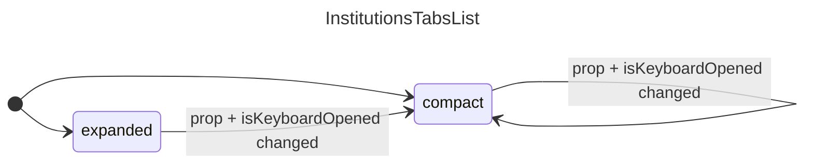

## InstitutionsTabsList
### Props
```diff
// Props
- isCompact (bool) // renamed to isKeyboardOpened
- Institutions (array) // get from context
- onCreate (function) // get from context
- selectedInstitutionId (number) // not needed. Used by InstitutionsList
+ isKeyboardOpened 

// Context
+ {
+    institutionsFieldArray: { fields: institutions },
+    handlers: { handleInstitutionCreate },
+ } = useFormContext()
```

### Listeners
- restoreButton click

### States
