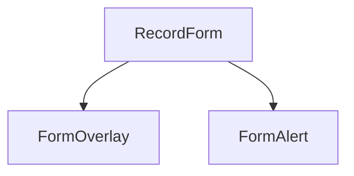
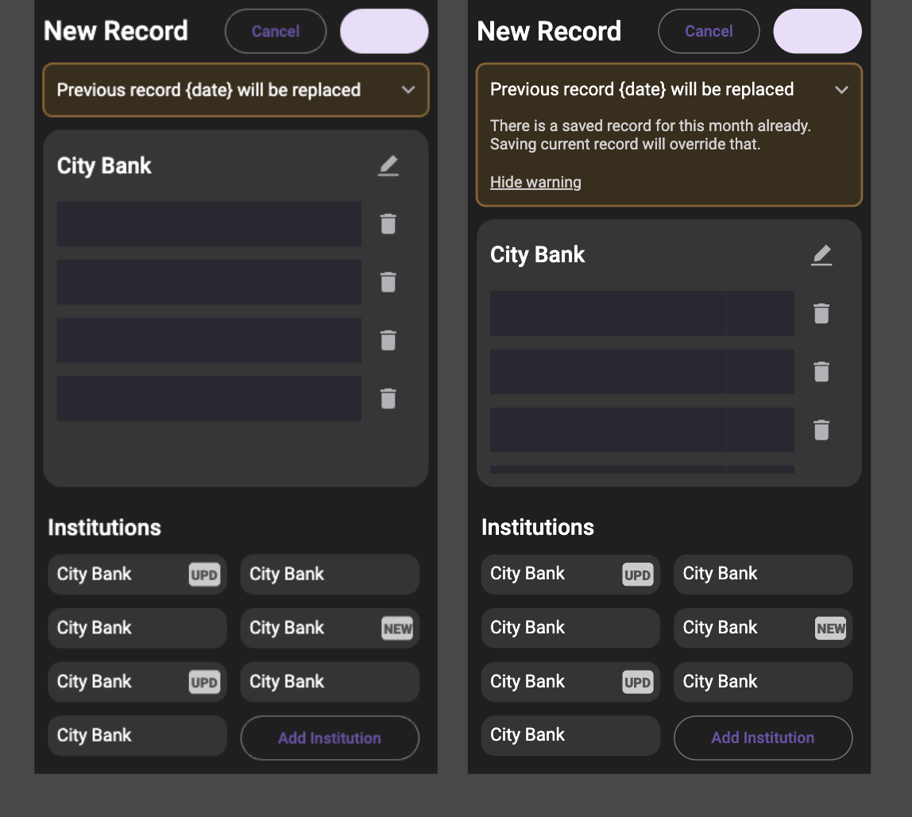

## FormOverlay
Overlays form body. Used for empty states and blocking errors. Can contain hidden system error text.

## FormAlert
Alert, appended to the top of RecordForm. Used for non-blocking warnings or information. Can be expanded and explicitly closed until reload of the form.

