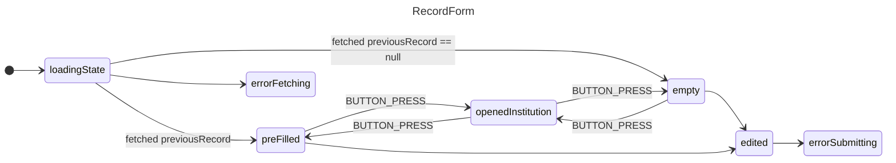

## RecordForm
### Server actions
- appendRecord
- getLatestRecord

### Listeners
- saveButton onClick
- cancelButton onClick

### States
- selectedInstitutionIndex (number)
- isInstitutionOpen (bool)
- useForm
- useFieldArray

## See also
- [next.js/examples/next-forms at canary · vercel/next.js · GitHub](https://github.com/vercel/next.js/tree/canary/examples/next-forms)
- [Data Fetching: Server Actions and Mutations | Next.js](https://nextjs.org/docs/app/building-your-application/data-fetching/server-actions-and-mutations#forms)
- https://react-hook-form.com/docs/usefieldarray