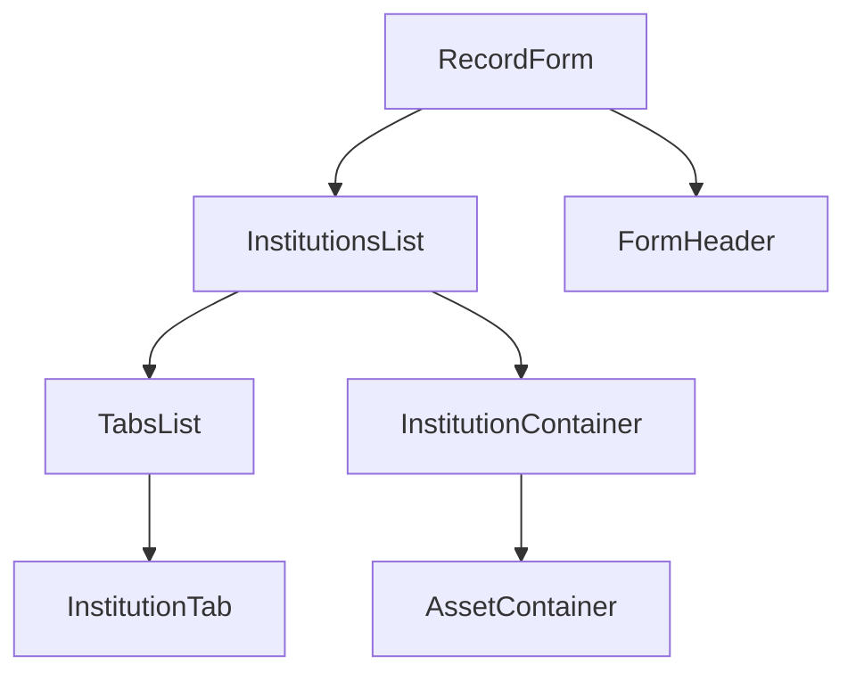

# App architecture

## Component tree

### RecordForm
Structural component. Will render Header Tabs, InstitutionContainer accordingly to state:
- `isKeyboardOpen`
- `isInstitutionContainerExpanded`

### FormHeader
Stateless component. Contains *submit* and *cancel* buttons

### TabsList
Statless component. Can be `collapsed` and `expanded`

### InstitutionTab
Statless component. Can show institution states:
- `new` 
- `updated`
- `deleted`

### InstitutionContainer
Can be `collapsed` and `expanded`

### AssetContainer
Can be `collapsed` and `expanded`

### InstitutionsList
Wrap `InstitutionContainer`s and `TabsList`.
Basically `Tabs` component from ChakraUI

## Fetching initial data
I wanna try RSC for this 
