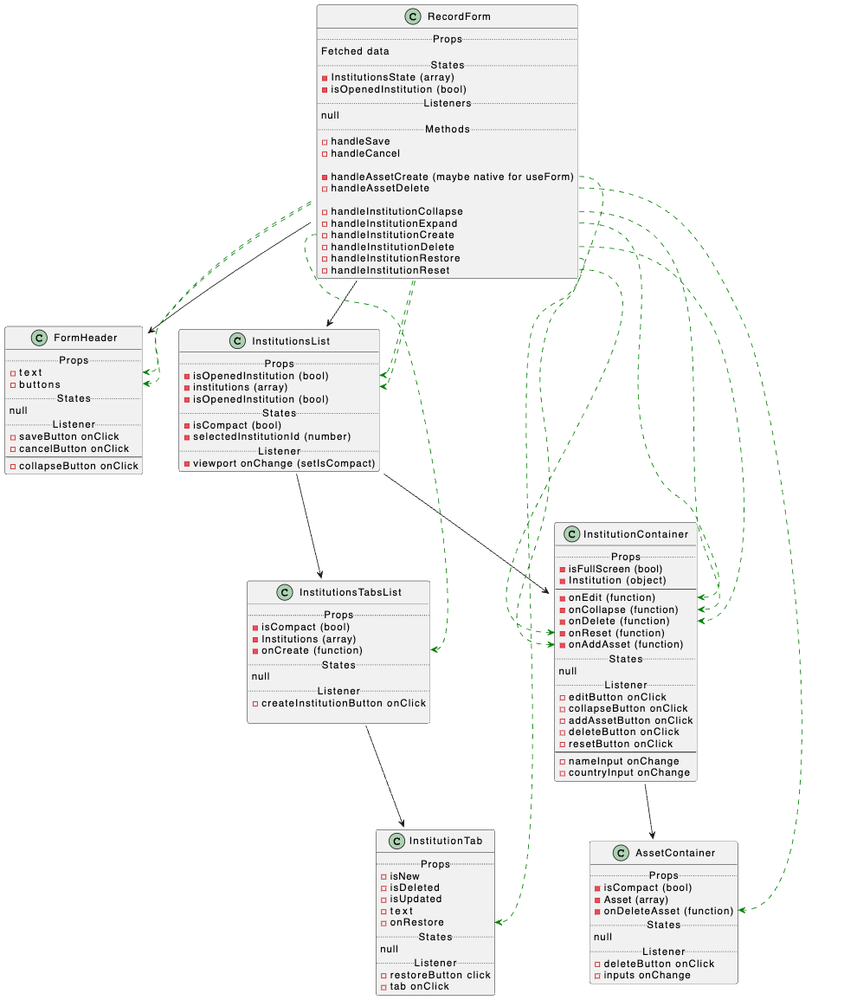
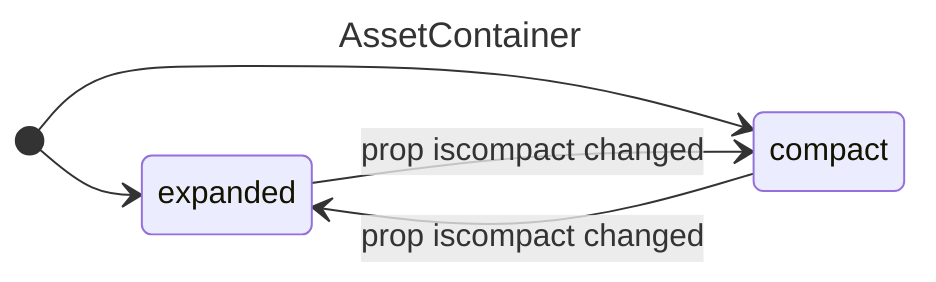
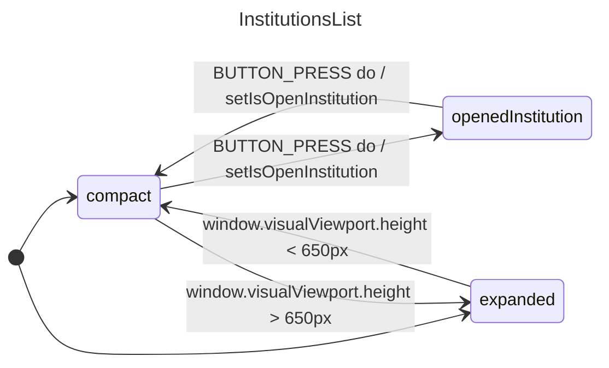
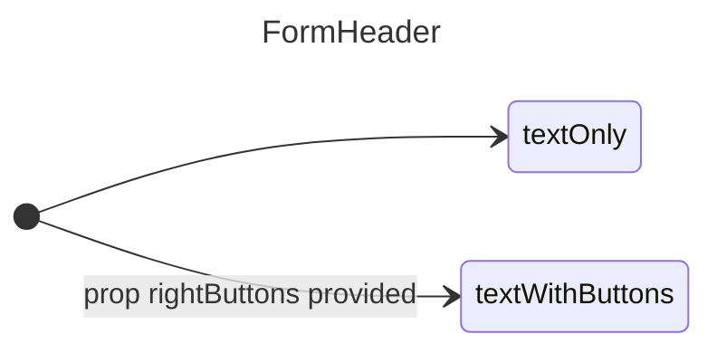
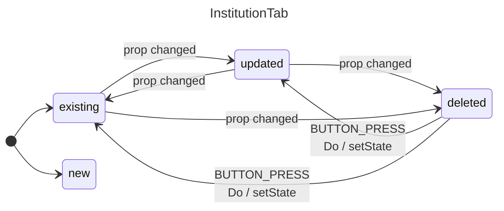
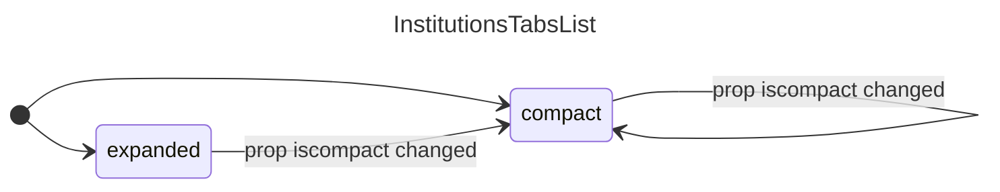
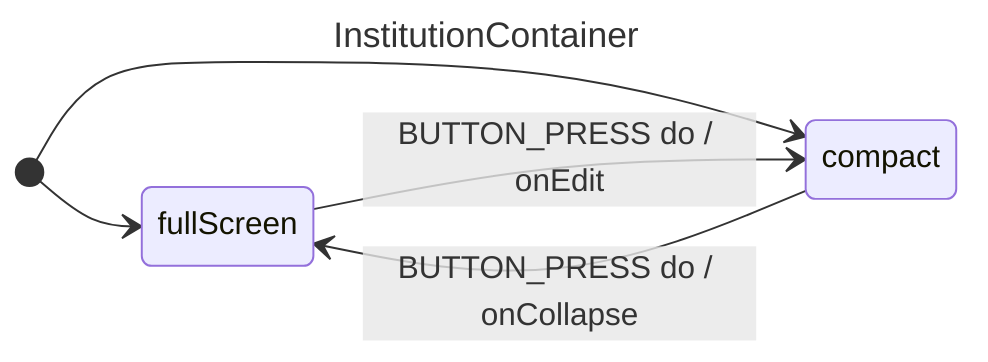
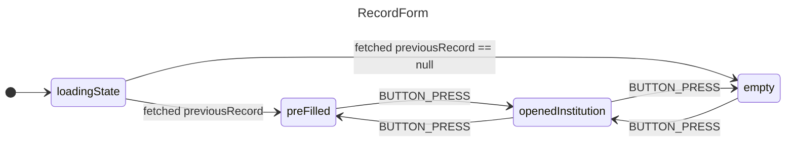

## Initial Data Flow

- [App Architecture](app-architecture.md)
- Data Flow

## AssetContainer
### Props
- isCompact (bool)
- Asset (array)
- onDeleteAsset (function)

### Listeners
- deleteButton onClick
- inputs onChange

### States

## InstitutionsList
### Props
- isCompact (bool)
- isOpenedInstitution (bool)
- institutions (array)

### States
- selectedInstitutionId (number)

## FormHeader
### Props
- text
- buttons

### States

## InstitutionTab
### Props
- isNew
- isDeleted
- isUpdated
- text
- onRestore

### Listeners
- restoreButton click

### States

## InstitutionsTabsList
### Props
- isCompact (bool)
- Institutions (array)
- onCreate (function)
- selectedInstitutionId (number)

### Listeners
- restoreButton click

### States

## InstitutionContainer
### Props
- isFullScreen (bool)
- Institution (object)
---
- onEdit (function)
- onCollapse (function)
- onDelete (function)
- onReset (function)
- onAddAsset (function)

### Listeners
- editButton onClick
- collapseButton onClick
- addAssetButton onClick
- deleteButton onClick
- resetButton onClick
---
- nameInput onChange
- countryInput onChange

### States

## RecordForm
### Server actions
- fetch previousRecord

### Listeners
- saveButton onClick
- cancelButton onClick

### States
- InstitutionsState (array)
- isOpenedInstitution (bool)
- useForm
